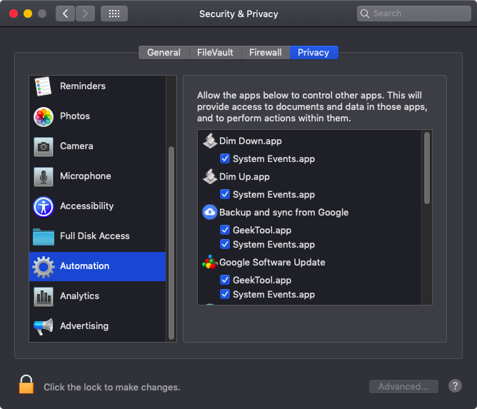
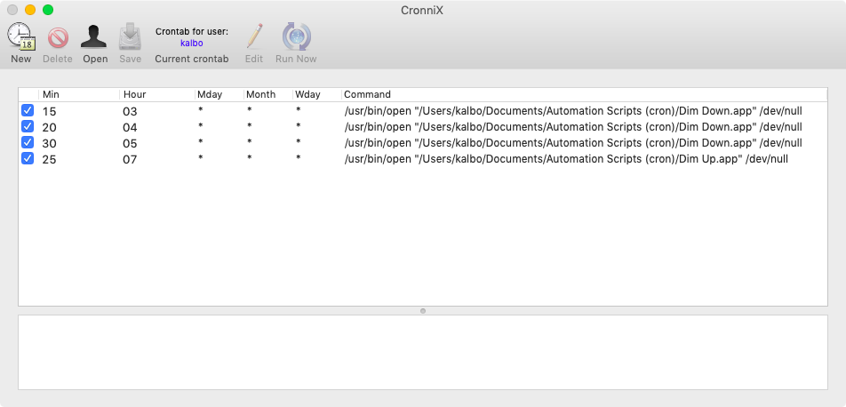

# Dim Up / Dim Down for macOS
This repository contains custom AppleScripts to control the brightness and volume of your Mac. Tested on macOS 10.14 (Mojave).

*Uses:* Automatically dim display to zero (black) and mute Mac at night, and bring brightness and volume back up in morning.

### Setup

1. Place .app files in a location on your mac eg (`~/scripts`).
2. Grant macOS access to automation in `System Preferences` -> `Security & Privacy` -> `Privacy` -> `Automation`.
3. Setup cron jobs to dim up / dim down your Mac.

### Best paired with CronniX
Manage cron jobs on macOS with CronniX: https://code.google.com/archive/p/cronnix/downloads

## License

Released under the MIT license
